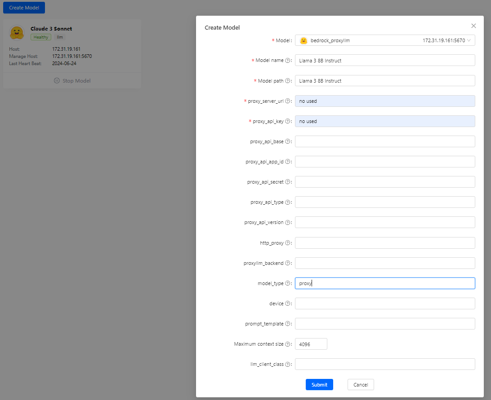
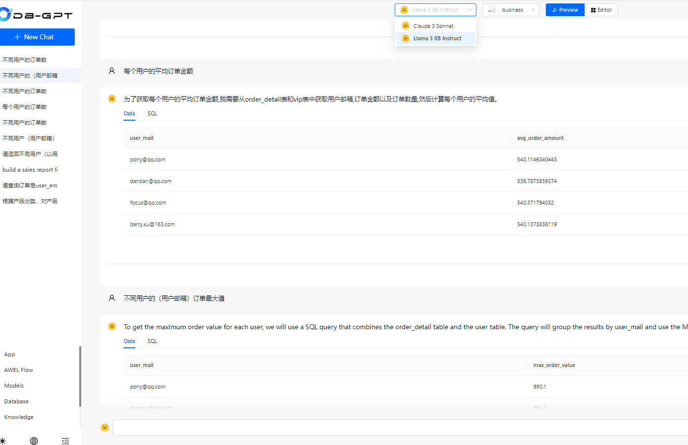

# 在AWS上部署DB-GPT
 
<p align="left">
  
</p>

本项目fork自DB-GPT, 用于支持基于bedrock 和sagemaker的代理

## 部署
### Bedrock


1. 参考官方文档创建.env环境变量文件，添加或修改如下环境变量：
```
LLM_MODEL=bedrock_proxyllm

AWS_REGION=us-east-1
# 可选,如果使用ak,sk访问bedrock，需要创建用户及配置bedrock 权限。如果不配置如下环境变量，需要你的db-gpt运行的环境中，绑定具有访问bedrock权限的角色

AWS_ACCESS_KEY=<your key>
AWS_SECRET_ACCESS_KEY=<your secret>
```
2. 如果配置了如下环境变量，则默认会创建一个基于bedrock 代理的该模型服务，如果没有设置，可以后续在界面模型配置bedrock 的其他模型
```
model_name=Claude 3 Sonnet
```


3. 参照官方文档[部署](https://www.yuque.com/eosphoros/dbgpt-docs/qno7x8hmgyulbg80)
### SageMaker

## 使用
### Bedrock
1. 如果配置了环境变量
```
model_name
```
则在模型管理页面默认就能看到名为环境变量值的模型代理服务，如果没有配置，可以在模型管理页面添加，请选择Model为bedrock_proxyllm,模型名称为bedrock支持，并且你账号开通的模型


<p align="left">
  
</p>

2. 配置完建议刷新一下页面

3. 开启新的对话窗口，即可选择对应的模型进行交互
<p align="left">
  
</p>

### Sagemaker


